# mobile-flashcards
A mobile application for Android and iOS that allows users to study collections of flashcards. The app allows users to create different categories of flashcards called "decks", to add flashcards to those decks and then take quizzes on those decks.

This app was built using react-native.

## installation

To test the application:

* install all project dependencies with `yarn install`
* start the test server with `yarn start`

## screenshots on ios and android

### decks view

   
  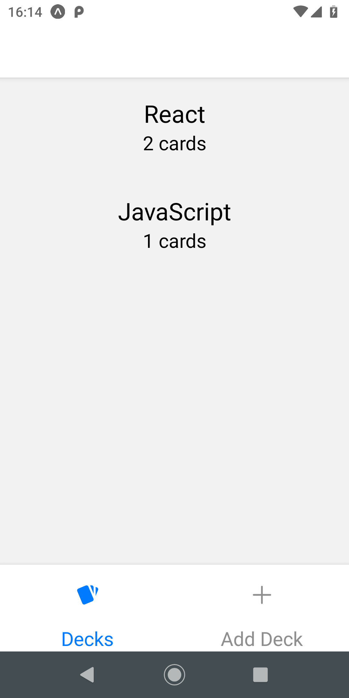

### deck view

  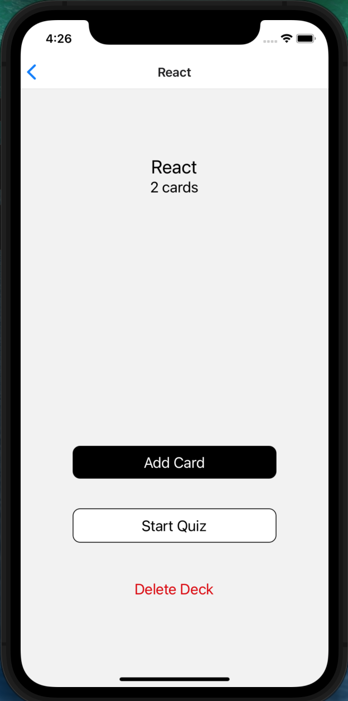 
  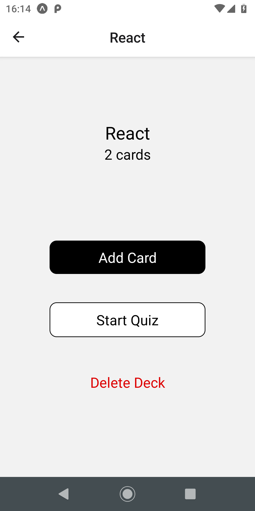

### add deck view

  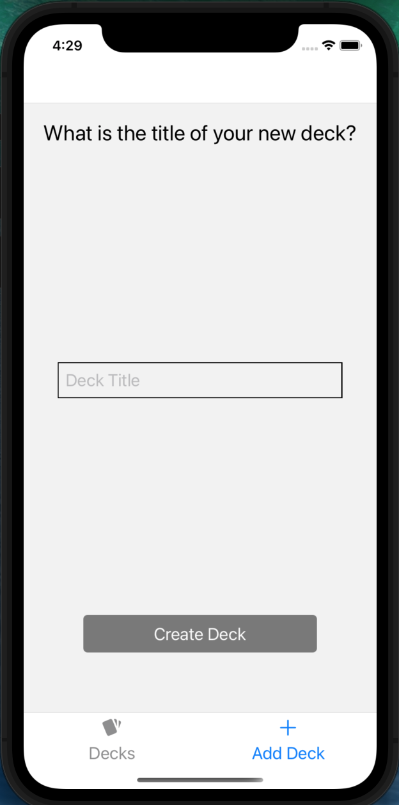 
  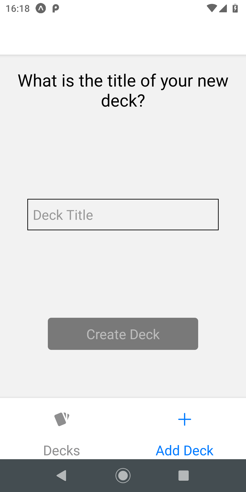

### add card view

  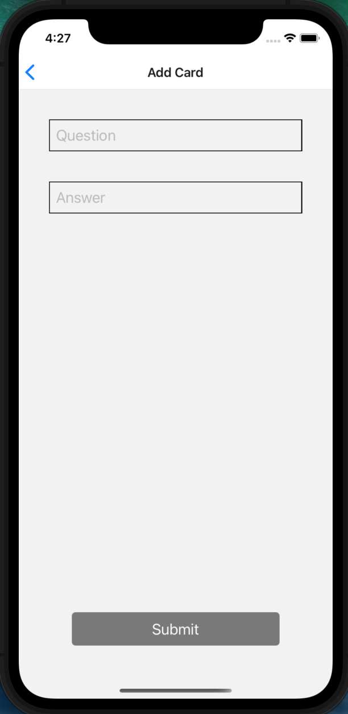 
  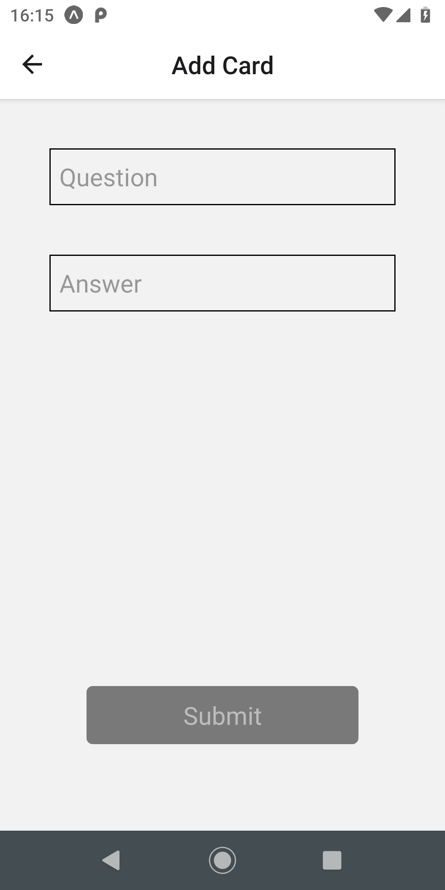

### quiz question view

  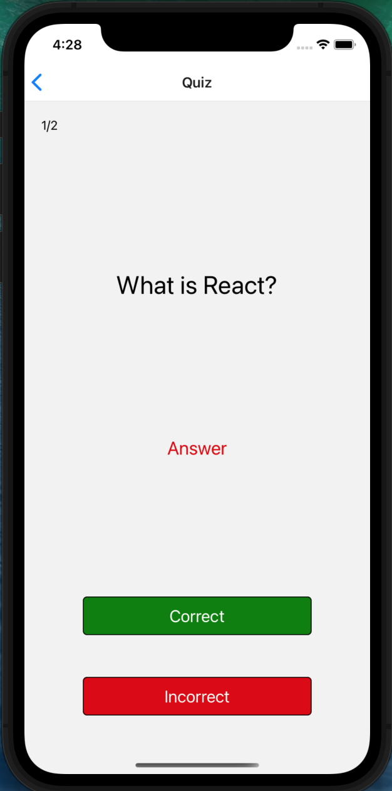 
  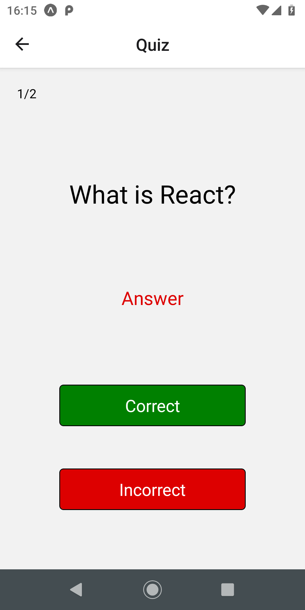

### quiz answer view

  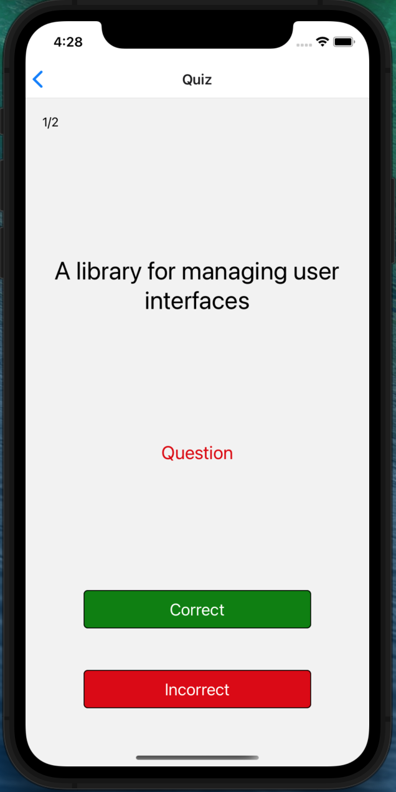 
  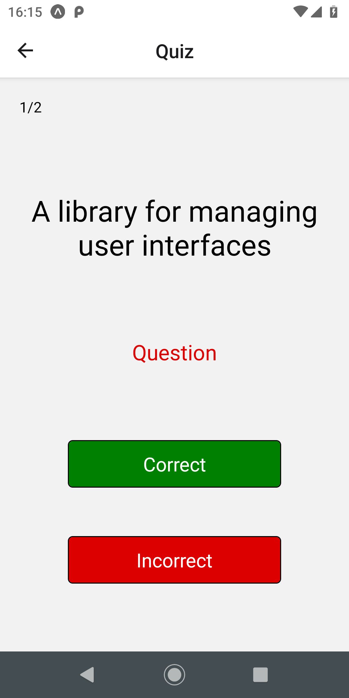

### quiz complete view

  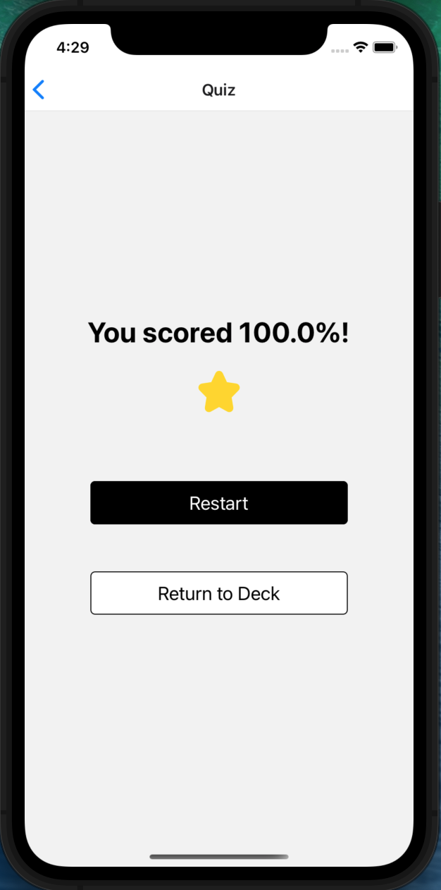 
  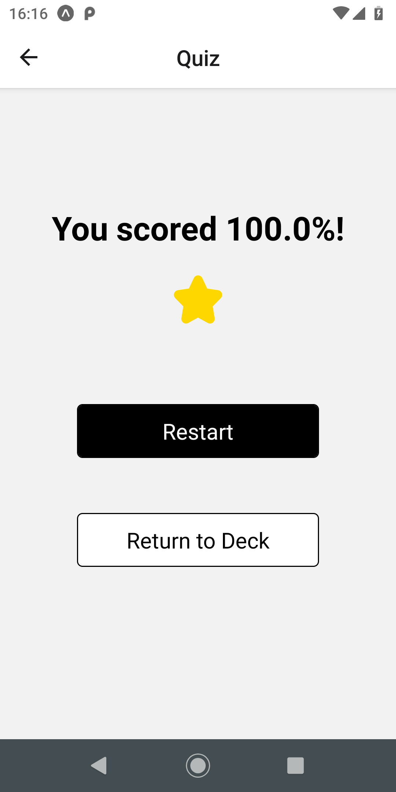

